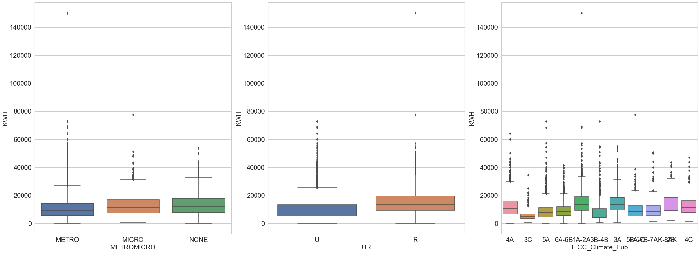
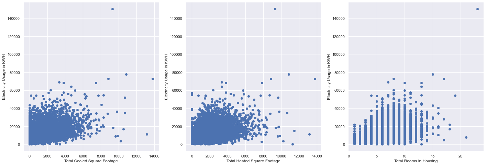
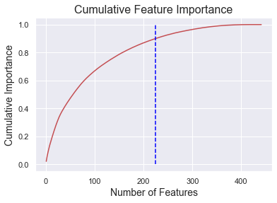
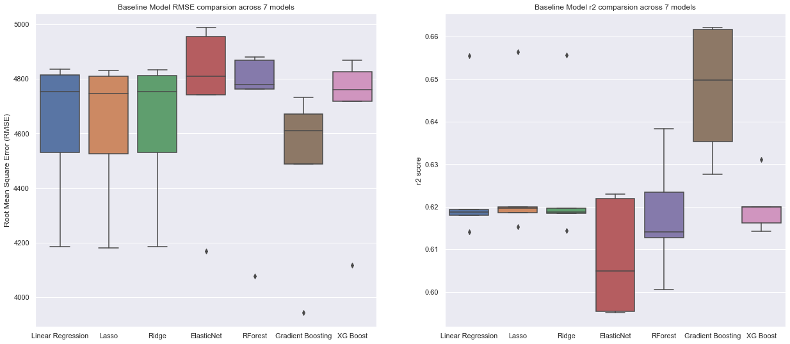

# [Residential Energy Prediction](https://github.com/nipun-goyal/Residential-Energy-Consumption-Prediction)

Contents:
- [Project Overview](#overview)
- [Exploratory Data Analysis and Data Transformation & Preprocessing](#eda-and-data-transformation--preprocessing)
- [Principal Component Analysis]()
- [Feature Selector]()
- [Model Comparison]()
- [How to Run](#How-to-Run)

## Overview
Every four years, [EIA](https://www.eia.gov/consumption/residential/) administers the Residential Energy Consumption Survey (RECS) to a nationally representative sample of housing units across the United States to collect energy characteristics data on the housing unit, usage patterns, and household demographics. 

This project focused on 2009 RECS survey data , extracted from [USA EIA website](https://www.eia.gov/consumption/residential/data/2009/) which represents the 13th iteration of the RECS program. First conducted in 1978, the Residential Energy Consumption Survey is a national sample survey that collects energy-related data for housing units occupied as a primary residence and the households that live in them. 2009 data were collected from 12,083 households selected at random using a complex multistage, area-probability sample design. The sample represents 113.6 million U.S. households, the Census Bureau’s statistical estimate for all occupied housing units in 2009 derived from their American Community Survey (ACS). 

With a combination of linear as well as Ensemble machine learning methods, the project objective was to:

- Describe/Explore the set of features with the strong statistical associations with target variable Annual Electricity Usage (in kWh)
- Use the selected features to predict total Consumption of Energy in residential homes

The target variable was "KWH" which stands for kilowatt-hour.

The Principal Component Analysis coupled with [FeatureSelector](https://github.com/nipun-goyal/Residential-Energy-Consumption-Prediction/blob/main/feature_selector.py) was utilized to determine the important features for modeling purpose. These important features were then fed into different linear and ensemble machine learning techniques to generate prediction

## EDA and Data Transformation & Preprocessing

#### The RECS 2009 survey data consisted of more than 900 variables collected across housing characteristics, appliances used, fuel types, annual consumption and cost of consumption. 

- In the EDA section, data dimesionality and data types from the RECS survey data were explored. Summary statistics was generated as well to check if there were any outlier values in the dataset. The features that were found to have outliers were later explored in-depth using Box Whisker and Kernel Density Estimate (KDE) plots. Below are snippets of box and KDE plots that were built. The outliers were identified and later dropped in data preprocessing section. For example, rows with KWH > 80,000 were dropped (only 1 row)

- No missing values were found in the dataset. Exploratory Data Analysis was largely done using scatter, bar, box-whisker and Median KWH plot to understand the relationship between variables. Median KWH plot is a plot showing median KWH values across different values of discrete numeric variables i.e. the variables whose values exist in a particular range or are countable in a finite amount of time. Below are the snippets of plots compiled in EDA section

Based on the data Exploration, various transformations on data was performed such as, merging features, merging levels of discrete predictor features because of their low frequency count, removing the features with high number of Not Applicable (NA) values, removing imputation flags i.e. columns starting with 'Z', removing duplicate features, dropping unnecessary columns and lastly removing outliers (just one row with KWH > 80,000)

## Principal Component Analysis (PCA)

**Principal Component Analysis (PCA) is a dimension-reduction tool. Plugging in the whole dataset through PCA, the scree plot looks for elbow criterion (or bend) in the curve to show how many features can be used to include in the model.** 

The PCA Elbow curve below shows features that explain most of the variance (above 95%). Approximately, 200 features result in variance close to ~ 95%. The PCA analysis gives us a ballpark estimate of the number of features that explains majority of the variation in the dataset and hence can be used for data modeling.

## Feature Selector
Post Data Transformation and Preprocessing, we had 428 features that were put through feature engineering to optimise the dimensions.

`FeatureSelector` class used five methods to identify the features to remove:
- Features with a high percentage (60%) of missing values
- Collinear (highly correlated, 98% correlation) features
- Features with zero importance after one hot encoding in a tree-based model
- Features with low importance (i.e. where cumulative importance is below the threshold of 90 %)
- Features with a single unique value

Post feature selection, the original number of 428 features were reduced to 216 features.

## Baseline Models
Supervised learning usually starts with linear models. Hence, linear models coupled with ensemble methods were built and then trained using the defauly hyperparameters to form our baseline models. If we were to fit the model with the training set while evaluated with the test set, we obtained only a single sample point of evaluation with one test set. How can we be sure it is an accurate evaluation, rather than a value too low or too high by chance? If we have two models, and found that one model is better than another based on the evaluation, how can we know this is also not by chance?

Hence, cross validation technique was used to evaluate each model multiple times with different dataset and average score was considered for the decision to choose the final model candidate for evaluation on holdout dataset or test dataset. Cross validation uses k-fold to resample the same dataset multiple times and pretend they are different. With cross validation, as we are evaluating the model, or hyperparameter, the model has to be trained from scratch, each time, without reusing the training result from previous attempts.

All or Most supervised learning starts with Linear Models. Linear Models provide a varied set of modeling techniques like Ridge, Lasso etc.,

To predict RECS price or consumption, we utilize these linear models along with GridSearchCV to fine tune each of the models

Process we followed, 

Linear model results,

Linear model residual plot,

## RandomForest Regressor
Random Forest method is used to classify the data into classes and predict the mean (regression) of the forest trees to predict Total Dollar 

Process we followed, 

RandomForest model results,

RandomForest model residual plot,

## XGBoost Regressor
....XGBoost (“Extreme Gradient Boosting”) is one of the Ensemble Algorithms used as regressor  or classifier. With all the previous models yielding results of around 81% r2 value, thus clearly indicating presence of weak predictors. As XGBoost is known for its ability to create a strong model with weak predictors, we decided to use this for predicting total dollar and consumption.  

Process we followed, 

XGBoost model results,

XGBoost model regression error plot,

## Model Comparison
...Using SKLearn.Cross_validate function, we peformed a comparison of the 7 models, both base and tuned version. 

- In the base models,  we see that all the models perform on par except LassoCV which had the lowest accuracy of about 70%
- Once the models were tuned using hyper-parameters, the cross-validate was re-run against the tuned models.
- The results show that all Linear models (post tuning) have the same accuracy. However tree based models (RF and XGBoost) have better accuracy.

Model Performances are depicted below,

Results of RMSE and r2,

## How to Run

- Clone or download github files into a local directory
- Install required python packages from [requirements.txt](https://github.com/nipun-goyal/Residential-Energy-Consumption-Prediction/blob/main/requirements.txt) file by creating virtual environment
- Activate the virtual environment
- Open Jupyter notebook and open 1.0-Residential-Energy-Modeling.ipynb
- Run notebook and observe results
